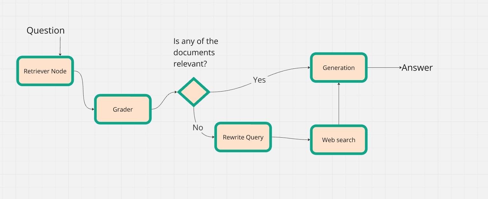

## Table of contents
- [Server](#server)
  - [Introduction](#introduction)
  - [Executing](#executing)
    - [Install Packages](#install-packages)
    - [Run Backend](#run-backend)
    - [Open frontend](#open-frontend)
  - [API Explanation](#api-explanation)
    - [Generating the Keys](#generating-the-keys)
    - [TOGETHER.AI](#togetherai)
    - [LangChain](#langchain)
  - [Implementation](#implementation)
  - [Key Components of the Server](#key-components-of-the-server)
    - [**Unique Type**](#unique-type)
    - [**Retriever**](#retriever)
    - [**Grader/Rewriter**](#graderrewriter)
    - [**LangGraph**](#langgraph)
      - [Key Features](#key-features)
    - [**Generation**](#generation)
    - [**Web-search**](#web-search)
  - [Web scraping and concerns](#web-scraping-and-concerns)
    - [**Robot.txt Example**](#robottxt-example)
- [Scaling](#scaling)
  - [Deploying FLASK](#deploying-flask)
  - [Sources](#sources)

**22/01/2025**

# Server

## Introduction

This README file is designed to help users understand and utilize the server_v4.py file and its associated APIs. It provides clear instructions on how to execute the server, including installing necessary packages and running both the backend and frontend components. The README also explains the required environment variables for API keys, offers examples of API usage, and addresses concerns related to web scraping. Overall, it aims to make the setup and usage of the server straightforward, even for those who may not be tech-savvy.

## Executing

- Double-click the `open.bat` file to run the Python file and open the website from the parent directory.

### Install Packages

- Ensure all necessary packages are installed.

### Run Backend

```bash
.\myenv\Scripts\python.exe .\server_v4.py
```

### Open frontend 
 > cd .\src\   
 > npm run dev
 = Open the URL provided by the frontend server.

## API Explanation

- The following environments are needed for the server.
- The .env file should be in the root directory and look like this:

```
OPENAI_API_KEY="your-key-here"
TOGETHER_API_KEY ="your-key-here"
LANGCHAIN_API_KEY ="your-key-here"
GOOGLE_API_KEY ="your-key-here"
GOOGLE_SEARCH_ID ="your-search-id-here"
```
### Generating the Keys 

An API key is a unique identifier used to authenticate requests associated with your project for usage and billing purposes. It's like a password that allows you to access and interact with an API (Application Programming Interface).

CTRL + right-click the URLs to open the links.

**Together.AI API key - https://www.together.ai**  

- Click "Get Started" in the top right corner.
- Sign in using your Google, LinkedIn, or GitHub account.
- Click the icon in the top right corner and go to "Settings."
- Under "API Keys," copy the key and paste it into the .env file as: ``TOGETHER_API_KEY="paste-here"``.
- Langchain follows a similar method. Sometimes, the key is provided during the initial sign-in steps.

**Langchain API key - https://www.langchain.com**   
  
- Click "Sign Up" next to "Don't have an account? Sign up!" and create an account using Google if you prefer.
- Click "Get Started," then "Step 1: Generate an API Key."
- Copy the key and paste it into the .env file as: ``LANGCHAIN_API_KEY="paste-here"``.


**Google Search api kwy - https://developers.google.com/custom-search/v1/introduction**

- Sign in and click "Get a Key" under "Identify your application..."
- Create a project and name it.
- Click "Show Key," copy it, and paste it into the .env file as: ``GOOGLE_API_KEY="paste-here"``.


**Google search ID - https://programmablesearchengine.google.com/controlpanel/all**
- Sign in, and you will see the search engines.
- Add a search engine (you can tick "Search the entire web") and click "Create."
- Click "Customize," and in the third row under "Basic," find the search engine ID.
Copy and paste this into the .env file as: ``GOOGLE_SEARCH_ID="paste-here"``.


### TOGETHER.AI   
- LangSmith uses a wide plethora of LLM's. I have opted to use Together.ai for testing purposes. If you click the user icon in the top right corner. Head into setting

```python
from langchain_openai import ChatOpenAI

### Together.ai example (used in the server)
model = ChatTogether(
    model="meta-llama/Meta-Llama-3.1-8B-Instruct-Turbo",
    temperature=0,
    max_tokens=320,
    # top_k=50,
    together_api_key= os.getenv("TOGETHER_API_KEY")
)

### using openai api


openai.api_key = os.getenv("OPENAI_API_KEY")
llm = ChatOpenAI(model="gpt-3.5-turbo-0125", temperature=0)
```
- The api key must be declared. 


### LangChain
- Using LangSmith with these environment variables enables detailed tracing and inspection of the execution flow within your LangChain chains or agents, helping you debug and optimize your workflows.
```python
# (optional) LangSmith to inspect inside your chain or agent.
os.environ["LANGCHAIN_TRACING_V2"] = "true"
os.environ["LANGCHAIN_API_KEY"] = os.getenv("LANGCHAIN_API_KEY")
```

## Implementation   


## Key Components of the Server

### **Unique Type**
```python

class GraphState(TypedDict):
    """
    Represents the state of our graph.

    Attributes:
        question: question
        generation: LLM generation
        web_search: whether to add search
        documents: list of documents
    """

    question: str
    generation: str
    web_search: str
    documents: List[str]
```

- This custom type is used throughout the server to load each state within the graph.

### **Retriever**
```python
def setup_retriever():
    ### Create Index using an the data folder:
    file_url = open('data/urls/links.txt')
    ### Create Index using an the data folder:
    # Open and read the URL file
    with file_url as file_url:
        url_txt = file_url.read()

    # Split the content into a list of URLs and filter out empty lines
    urls = [url for url in url_txt.split("\n") if url.strip()]

    # loads the text from urls
    docs = [WebBaseLoader(url).load() for url in urls]
    docs_list = [item for sublist in docs for item in sublist]

    # Splits the document into smaller chunks 
    text_splitter = RecursiveCharacterTextSplitter.from_tiktoken_encoder(
        chunk_size=250, chunk_overlap=40
    )

    doc_splits = text_splitter.split_documents(docs_list)

    # Create a vector store from the document splits
    vectorstore = FAISS.from_documents(documents=doc_splits, 
                                        embedding = TogetherEmbeddings(model="togethercomputer/m2-bert-80M-8k-retrieval")
                                        )
    retriever = vectorstore.as_retriever()
    # Return the retriever object
    return retriever


retrieval_grader = setup_grader()

```
- This shows how to use URLs to load the retriever, making it easy to edit and more complex than loading text files.  
- Text from these webpages is converted to digestible chunks and encoded.  
- Documents with high cosine similarity to the question will be used in the context.  
- If text files are required, use: `TextLoader(‘common_questions.txt').load()` and similarly split.

### **Grader/Rewriter**    

This example uses the grader, but the same steps apply to the question rewriter.

```python
# ranks if the obtained documents should be used when generating the response
def setup_grader():
    structured_llm_grader = llm.with_structured_output(GradeDocuments)

    # Prompt
    system = """You are a grader assessing relevance of a retrieved document to a user question. \n 
        If the document contains keyword(s) or semantic meaning related to the question, grade it as relevant. \n
        Give a binary score 'yes' or 'no' score to indicate whether the document is relevant to the question."""
    grade_prompt = ChatPromptTemplate.from_messages(
        [
            ("system", system),
            ("human", "Retrieved document: \n\n {document} \n\n User question: {question}"),
        ]
    )
    retrieval_grader = grade_prompt | structured_llm_grader
    return retrieval_grader 

### choosing a simpler llm for grading and rewriting
llm = ChatTogether(
    model="cheaper_model",
    temperature=0,
)

### used to grade the document 
retrieval_grader = setup_grader()
```
- The retriever only chooses documents similar to the questions asked, but this does not ensure relevancy, so a grader is used.
- Verifying generated documents ensures accuracy, and rewriting the question allows the web-search feature to find the most relevant documents.
- Using cheaper models for grading and rewriting can save costs.
- This highlights how models can be programmed to give specified answers.


### **LangGraph**   

LangGraph is a framework that combines graph databases and large language models (LLMs) to transform complex data into clear, actionable insights. It helps by simplifying data analysis, enhancing context understanding, and enabling intuitive visualization.

```python
workflow = StateGraph(GraphState)

# Define nodes from graph
workflow.add_node("retrieve", retrieve)
workflow.add_node("grade_documents", grade_documents)
workflow.add_node("generate", generate)
workflow.add_node("transform_query", transform_query)
workflow.add_node("web_search_node", web_search)

# Build Graph
workflow.add_edge(START, "retrieve")
workflow.add_edge("retrieve", "grade_documents")
workflow.add_conditional_edges(
    "grade_documents",
    decide_to_generate,
    {
        "transform_query": "transform_query",
        "generate": "generate",
    },
)
workflow.add_edge("transform_query", "web_search_node")
workflow.add_edge("web_search_node", "generate")
workflow.add_edge("generate", END)

# Compile
crags = workflow.compile()
```
- This example shows how the prior graph can be realized using the API. First, the nodes are initialized, and the connections are realized by the edges.

#### Key Features

- Easy Customizability: For example, after web_search, grade the URLs for relevancy.

```python
### Example without the web search
workflow.add_edge("web_search_node", "grade_web_documents")
workflow.add_conditional_edges(
    "grade_web_documents",
    decide_to_generate,
    {
        "generate": "generate",
        "inform_user": "inform_user",
    },
)
workflow.add_edge("generate", END)
workflow.add_edge("inform_user", END)
```
- Incase the web search feature is spending too much tokens, one can simple edit the graph.

### **Generation**

```python
rag_chain = (
    prompt
    | model
    | StrOutputParser()
)

def generate(state):
    """
    Generate answer

    Args:
        state (dict): The current graph state

    Returns:
        state (dict): New key added to state, generation, that contains LLM generation
    """
    print("---GENERATE---")
    question = state["question"]
    documents = state["documents"]

    # RAG generation
    generation = rag_chain.invoke({"context": documents, "question": question})
    # print("got the generation")
    return {"documents": documents, "question": question, "generation": generation}
```
- We define the rag chain model and using invoke you can generate the prompt. There are other options when generating a response e.g:`stream,astream...` which can provide a typed out response.
- By using a custom type, you can provide the user evidence when generating the prompt, and also see each stage of CRAGS.

### **Web-search**   

This method aims to include a dynamic component to the program, especially when there are no relevant documents as deemed by the grader. Any useful documents found are then added to the retriever and incorporated into the dataset. Note that this is a prototype method and may be too slow for practical use.

```python
# uses the question to generate relevant urls
def google_search(query, API_KEY, SEAERCH_ID):
    url = f"https://www.googleapis.com/customsearch/v1?key={API_KEY}&cx={SEAERCH_ID}&q={query}&start={1}"
    response = requests.get(url)
    if response.status_code == 200:
        results = response.json()
        urls = []

        try:
            # the urls are stored in items 
            searches = results['items']
            for item in searches[:5]:
                urls.append(item['link'])
        except KeyError:
            print("No items found in the results.")
            return None
        return urls
    else:
        return None

urls = google_search(question,api_key,search_engine)
```
- This methods uses the google search api and a simplified prompt to generate URLs that relate to the question.
- Prone to errors if the question is in a complex format.
- This methods requires three items, the query, google search api key and the search id, seen in ``url``.

**Alternative Method**

One possible method is to use an LLM to generate the URLs. However, this would require a more expensive LLM (with a larger dataset), and since our objective is to reduce the number of tokens, we decided not to spend more than necessary:

```python
# Data model
class URLList(BaseModel):
    """List of URLs that relate to the given question"""

    urls: list = Field(
        description="List of URLs relevant to the question"
    )

def url_generator():
    structured_llm = llm.with_structured_output(URLList)

    # Prompt
    system = """You are a search engine that provides five of the most useful URLs for the given question. 
    Give a list of URLs starting from the most useful URL."""
    grade_prompt = ChatPromptTemplate.from_messages(
        [
            ("system", system),
            ("human", "User question: {question} \n Formulate the most useful URLs."),
        ]
    )

    url_generator = grade_prompt | structured_llm

url_gen = url_generator()
question = "What is Cryosurgery?"
urls = url_gen.invoke({"question": question})
print(urls)
```
-  This method relies on an expensive LLM. 
-  Weaker models are more prone to hallucinations and find tasks like this difficult.

## Web scraping and concerns
Web scraping involves extracting data from websites. However, it's important to respect the rules set by websites to avoid legal and ethical issues. This is typically done by checking the robots.txt file of the website, which specifies the parts of the site that can or cannot be accessed by automated agents.

### **Robot.txt Example**

This is what a robots.txt file might look like. As you can see, the first Disallow is left blank, so scraping is allowed on the base directory.
```
User-agent: *
Disallow: 
Disallow: /find-services/
```

A simple algorithm that checks if the URLs are allowed for scraping. The web scraper will add found URLs, and then it is important to run this to filter out any problematic URLs.

```python
import requests
from urllib.parse import urlparse

def append_url(url):
    parsed_url = urlparse(url)
    robots_url = f"{parsed_url.scheme}://{parsed_url.netloc}/robots.txt"
    response = requests.get(robots_url)
    if response.status_code == 200:
        return response.text
    else:
        return None

def parse_robots_txt(robots_txt, user_agent="*"):
    rules = {"Disallow": [], "Allow": []}
    user_agent_section = False
    for line in robots_txt.splitlines():
        line = line.strip()
        if line.startswith("User-agent:"):
            user_agent_section = (user_agent in line or "*" in line)
        elif user_agent_section:
            if line.startswith("Disallow:"):
                rules["Disallow"].append(line.split(":")[1].strip())
            elif line.startswith("Allow:"):
                rules["Allow"].append(line.split(":")[1].strip())
    return rules

def is_allowed(url, rules):
    parsed_url = urlparse(url)
    path = parsed_url.path
    for disallow in rules["Disallow"]:
        if disallow and path.startswith(disallow):
            return False
    return True

for url in urls:
    robots_txt = append_url(url)
    if robots_txt:
        rules = parse_robots_txt(robots_txt)
        if is_allowed(url, rules):
            print(f"{url}")
    time

```
 - Appending URL: The append_url function fetches the robots.txt file for a given URL.
- Parsing Robots.txt: The parse_robots_txt function reads the robots.txt file and extracts the rules for the specified user agent.
- Checking URL Permissions: The is_allowed function checks if a URL is allowed to be scraped based on the rules extracted from the robots.txt file.
- Filtering URLs: The loop iterates through the list of URLs, fetches and parses the robots.txt file for each, and prints the URLs that are allowed to be scraped.

# Scaling 

## Deploying FLASK
This requires Gunicorn: open environment and `$ gunicorn -w 4 'server_v4:app'` and $ ``gunicorn -w 4 'server_v4:create_app()'``
- I'll have to account for the switch to Ubuntu in the server end.

```
# On Ubuntu server
sudo apt update
sudo apt install python3-pip python3-venv nginx  # Nginx for reverse proxy later

# Create and activate a virtual environment
python3 -m venv venv
source venv/bin/activate

# Install packages
pip install -r requirements.txt

## running Gunicorn
gunicorn -w 4 -b 0.0.0.0:8000 'server_v4:app'

# Advanced (with config file)
gunicorn -c gunicorn.conf.py 'server_v4:create_app()'
```

## Sources 
 - CRAGS: https://github.com/langchain-ai/rag-from-scratch, most of the CRAGS implementation comes here, also a good explanation into how RAGs works.
 - Langchain: https://python.langchain.com/docs/how_to/, function needed finessing and shows integrations when using other LLM and other embedding models.   
**The following is a web search prototype:**
 - Google api key: https://developers.google.com/custom-search/v1/overview
 - Google search id: https://programmablesearchengine.google.com/controlpanel/all
