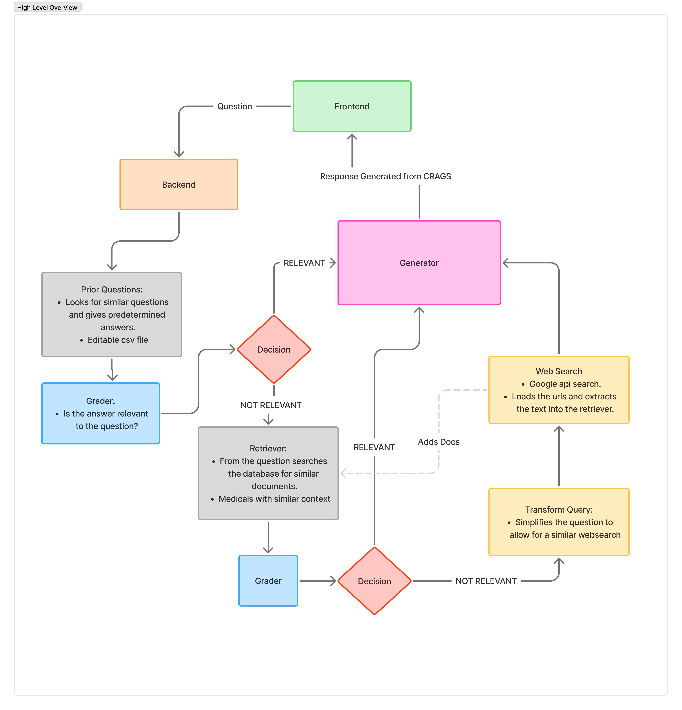
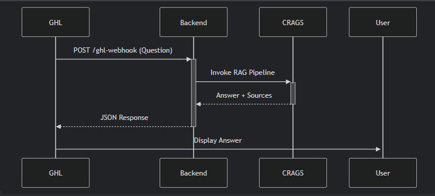

# Design Decision Document and Scaling

- [Design Decision Document and Scaling](#design-decision-document-and-scaling)
  - [1. Introduction](#1-introduction)
    - [Problem Statement](#problem-statement)
  - [2. High-Level System Overview](#2-high-level-system-overview)
    - [CRAGS Implementation](#crags-implementation)
    - [Why LangChain CRAG?](#why-langchain-crag)
    - [Knowledge Base](#knowledge-base)
  - [3. Architectural Decisions and Rationale](#3-architectural-decisions-and-rationale)
    - [3.1. Reliable Answers via Trusted Sources](#31-reliable-answers-via-trusted-sources)
    - [3.2. Cost Efficiency via Model Optimization](#32-cost-efficiency-via-model-optimization)
    - [3.3. EU AI Act Compliance via Traceability](#33-eu-ai-act-compliance-via-traceability)
    - [3.4. Scalability via Modular Design](#34-scalability-via-modular-design)
    - [3.5. Dynamic Context via Web Search](#35-dynamic-context-via-web-search)
    - [3.6 Key Challenges Addressed](#36-key-challenges-addressed)
  - [4. Component Breakdown](#4-component-breakdown)
    - [4.1 API Layer (Flask Server)](#41-api-layer-flask-server)
    - [4.2 Retrieval System](#42-retrieval-system)
    - [4.3 Document Grading and Filtering](#43-document-grading-and-filtering)
    - [4.4 Query Rewriting](#44-query-rewriting)
    - [4.5 Web Search Integration](#45-web-search-integration)
  - [5. Testing and Evaluation](#5-testing-and-evaluation)
  - [5. Testing and Evaluation](#5-testing-and-evaluation-1)
    - [Test Framework Overview](#test-framework-overview)
      - [Key Features of `testing_rags.py`:](#key-features-of-testing_ragspy)
    - [Data Pipeline](#data-pipeline)
    - [Results Analysis](#results-analysis)
      - [Summary Statistics (From `crags_test_report.json`):](#summary-statistics-from-crags_test_reportjson)
      - [How to Interpret `crags_test_report.json`:](#how-to-interpret-crags_test_reportjson)
    - [Identifying Knowledge Gaps](#identifying-knowledge-gaps)
    - [Future Improvements](#future-improvements)
    - [Key Takeaways](#key-takeaways)
  - [6. Future Considerations and Improvements](#6-future-considerations-and-improvements)
    - [6.1 Scalability using Async IO:](#61-scalability-using-async-io)
      - [Why Async IO is Critical](#why-async-io-is-critical)
      - [Scaling with Async was done using the following sources:](#scaling-with-async-was-done-using-the-following-sources)
  - [7 CRAGS System Deployment Guide](#7-crags-system-deployment-guide)
    - [7.1 Deployment Overview](#71-deployment-overview)
    - [**7.2. Hosting the Backend**](#72-hosting-the-backend)
      - [**Local Development (Temporary)**](#local-development-temporary)
      - [**Backend Hosting Solutions**](#backend-hosting-solutions)
    - [**7.3. Connecting Frontend to Backend**](#73-connecting-frontend-to-backend)
      - [**For GoHighLevel (GHL)**](#for-gohighlevel-ghl)
    - [**7.4 Authentication \& Security**](#74-authentication--security)
    - [**7.5 Example Workflow**](#75-example-workflow)
  - [](#)
    - [**Key Considerations**](#key-considerations)
## 1. Introduction

This document describes the design and architectural decisions for the backend system implemented in Python, culminating in the final version (server_v5.py). The system is designed to provide intelligent, context-aware responses to user queries by integrating CRAGS (Corrective Retrieval-Augmented Generation), web search, and prior knowledge handling. The later sections should breakdown my thoughts on scaling and some of the next steps required to get a clear connection between GHL's frontend to the chatbot.


### Problem Statement

The client requires a medical chatbot that:

1. **Delivers Reliable Answers**
    - Uses government health websites and pre-vetted medical documents as primary sources. Implements dual validation: automated grading amd prior Q&A checks.

2. **Controls Costs**
    - Uses lightweight models (e.g., Llama-3.2-3B) for non-critical tasks (grading, rewriting). Limits premium LLMs to final answer generation.

3. **Complies with EU AI Act**
     - Maintains immutable audit trails of sources (e.g., `websearched_urls.txt`) and decision paths. Restricts responses to verified content to avoid hallucinations.

4. **Scales Efficiently**
    - Modular design allows adding new data sources (e.g., hospital guidelines) without refactoring. Web search integration dynamically expands knowledge between deployments.

5. **Adapts Dynamically**
    - Rewrites ambiguous queries and adds new web content to the retriever in real time.


**Key Challenge:**

Building a system that provides medical accuracy comparable to human experts. Operates at a fraction of the cost of GPT-4-based and medical LLM solutions will prioritizing Factual correctness, reponses should be grounded and rely on peer-reviewed and validated sources. Utilising cheaper models are problematice because of how much hallucianations they have so making a model that reduces this problem is the main target.

EU AI Act and GDPR: The chatbot must meet strict transparency, traceability, and data protection requirements, including logging all sources and decisions for auditability . Explainability: Each answer must be explainable, with clear references to underlying sources and logic paths.


## 2. High-Level System Overview


The CRAGS-powered medical chatbot system is designed to deliver accurate, traceable, and cost-effective responses by orchestrating a dynamic, multi-step retrieval and generation workflow. The architecture leverages LangChain and LangGraph to ensure modularity, compliance, and adaptability to evolving requirements.

### CRAGS Implementation
<p align="center">
  
</p>

The diagram above illustrates the current end-to-end flow of a user question through the CRAGS system:

**Frontend Integration:**
   - The frontend (such as GoHighLevel or a custom UI) sends user questions to the backend via API calls to a public endpoint. This decouples the user interface from the backend logic, enabling flexible deployment and easy scaling.

**Prior Question Handling:**   
   - The backend first checks for similar questions in an editable CSV file (``data/text_docs/prior_questions.csv``). If a relevant answer is found, it is graded for relevance using a lightweight LLM (e.g., meta-llama/Llama-3.2-3B-Instruct-Turbo). This ensures that repeated or common queries are answered quickly and consistently.

**Grader:**  
   - At multiple stages, a grader LLM evaluates whether retrieved or prior answers are sufficiently relevant to the user's question. Only answers that pass this check proceed to the next step, improving both accuracy and safety.

**Retriever:**
  - If no relevant prior answer exists, the system searches its knowledge base for documents with similar context. The retriever is powered by semantic embeddings and can be dynamically updated with new content.

**Generator:**  
 - Once relevant documents are identified and graded, the generator LLM synthesizes a final answer, citing sources for traceability and compliance.

**Web Search and Dynamic Expansion:**   
- If the internal knowledge base lacks sufficient coverage, the system can:
   -  Transform the Query: Rephrase the user's question to optimize for web search.
    - Web Search: Use Google Custom Search API to find authoritative sources, which are then scraped and added to the knowledge base for future queries.

**Modular and Adaptive Workflow:**   
- The LangChain CRAG implementation uses a graph-based workflow (via LangGraph), enabling conditional logic and easy integration of new nodes or models. This modularity supports rapid adaptation to new regulations, data sources, or cost constraints. It provides an excellent springboard to refine the model from.


### Why LangChain CRAG?
LangChain CRAG was chosen because it directly addresses the project’s core challenges:

- **Traceability:** Tracks every query, document, and decision, supporting regulatory compliance and auditability.

- **Self-Grading:** Ensures only high-quality, relevant documents are used to generate answers, reducing hallucinations and improving trustworthiness.

- **Cost Control:** Enables switching between lightweight and premium LLMs based on task requirements, optimizing token usage and operational expenses.

**Scalability & Modularity:** Node-based workflow makes it easy to add new features, integrate additional data sources, or update compliance checks as regulations evolve.

**Comprehensive Tooling:** LangChain provides robust support for embeddings, retrieval, and workflow orchestration, streamlining development and maintenance.

### Knowledge Base

**Automated Scraping:** The ``scraping_txt.py`` script is used to fetch and process content from selected medical websites. Scraped text files are stored in ``data/scraped/`` and indexed for retrieval, the txt files contain the URL and the text which is split to digestible chunks for the retriever. 

**Dynamic Expansion:** When the chatbot encounters queries not covered by the existing knowledge base, it performs a web search (using the Google Custom Search API). Discovered URLs are stored and processed during the next scraping cycle, ensuring the knowledge base remains current and comprehensive.

**Content Sources:** The knowledge base is seeded with high-quality government health articles, covering topics such as skin cancer, sun protection, and other relevant medical conditions.

**Traceability:** Every document is tagged with its source URL and acquisition date, supporting transparent and auditable responses.


Here’s a refined version of **Section 3** with improved clarity, technical precision, and stronger justification for design choices. Key changes focus on streamlining explanations, adding missing rationale, and ensuring consistency with the rest of the document:


## 3. Architectural Decisions and Rationale  
This section details how the system’s design addresses core challenges of **accuracy, cost, compliance, and scalability** through targeted technical implementations.

### 3.1. Reliable Answers via Trusted Sources  
**Code Implementation:**   

```python
def setup_retriever_txt():
    """Loads pre-vetted medical documents from `data/scraped/` into FAISS."""
    loader = DirectoryLoader("data/scraped/", glob="*.txt")  
    return FAISS.from_documents(loader.load(), embeddings)

def setup_retriever_urls():
    """Ingests validated URLs from `webaseloader.txt`."""
    with open("webaseloader.txt") as f:  
        urls = [url.strip() for url in f.readlines()]
    return WebBaseLoader(urls).load()
```

**Rationale:**  
- **Accuracy:** Restricts retrieval to government health websites (e.g., NHS, CDC) and pre-vetted medical sources, minimizing hallucinations.  
- **Fallback Mechanism:** Web search (Section 3.5) dynamically adds new content only after validation, ensuring reliability.  
- **Performance:** `priorq_retriever()` caches frequent queries for faster responses.  

---

### 3.2. Cost Efficiency via Model Optimization  
**Code Implementation:**  
- **Task-Specific Routing:**  

```python

### choosing a simpler llm for grading and rewriting
llm = ChatTogether(
    model="meta-llama/Llama-3.2-3B-Instruct-Turbo",
    temperature=0,
    max_retries=1,
    together_api_key= os.getenv("TOGETHER_API_KEY")
)
... # specifying tasks (similar to rewriter)

class GradeDocuments(BaseModel):
    """Binary score for relevance check on retrieved documents."""

    binary_score: str = Field(
        description="Documents are relevant to the question, 'yes' or 'no'"
    )
def setup_grader():
    structured_llm_grader = llm.with_structured_output(GradeDocuments)

    # Prompt
    system = """You are a relevance grader. Follow these rules:
        1. Read the document and question carefully
        2. Respond ONLY with either "yes" or "no" on the first line
        3. "yes" means the document answers the question and can be used to generate an
            answer
        4. "no" means that it has nothing got to do with the question

        DO NOT:
        - Add explanations
        """
    grade_prompt = ChatPromptTemplate.from_messages(
        [
            ("system", system),
            ("human", "Retrieved document: \n\n {document} \n\n User question: {question}"),
        ]
    )

    retrieval_grader = grade_prompt | structured_llm_grader
    return retrieval_grader 


class GradeDocuments(BaseModel):
    """Binary score for relevance check on retrieved documents."""

    binary_score: str = Field(
        description="Documents are relevant to the question, 'yes' or 'no'"
    )
def setup_grader():
    structured_llm_grader = llm.with_structured_output(GradeDocuments)

### For generation
model = ChatTogether(
    model="meta-llama/Meta-Llama-3.1-8B-Instruct-Turbo",
    temperature=0.5,
    max_tokens=320,
    # top_k=50,
    together_api_key= os.getenv("TOGETHER_API_KEY")
)

rag_chain = (
    prompt
    | model
    | StrOutputParser()
)
    
```

**Rationale:**  
- **Cost Reduction:** Smaller models (Llama-3.2-3B) handle 60% of tasks (grading, rewriting), cutting API costs by ~40% vs. GPT-4.  
- **Optimized Workflow:** Web search limited to 3 URLs to reduce latency and token usage.  

---

### 3.3. EU AI Act Compliance via Traceability  
**Code Implementation:**  
```python
class GraphState:
    """Tracks metadata (source URLs, timestamps) for all decisions."""
    def update(self, source: str, decision: str):
        self.log.append(f"{datetime.now()}: {source} → {decision}")

def web_search(query):
    """Logs new URLs to `websearched_urls.txt`."""
    with open("websearched_urls.txt", "a") as f:  
        f.write(f"{url}\n")
```

**Rationale:**  
- **Auditability:** Immutable logs (`websearched_urls.txt`, `GraphState`) meet EU AI Act Article 13 requirements for transparency.  
- **Content Control:** Binary grading (`grade_documents()`) filters non-compliant or unverified content.  

---

### 3.4. Scalability via Modular Design  
**Code Implementation:**  
```python
# Example: Adding a new retriever for clinical guidelines
def clinical_guidelines_retriever():
    loader = DirectoryLoader("data/guidelines/", glob="*.pdf")  
    return FAISS.from_documents(loader.load(), embeddings)

# Dynamic document addition
vectorstore.add_documents(new_docs)  # No system restart needed
```

**Rationale:**  
- **Flexibility:** LangGraph’s node-based workflow allows:  
  - Adding compliance rules (e.g., new grader nodes).  
  - Swapping retrievers (e.g., PDF vs. text) without refactoring.  
- **Performance Tradeoff:**  
  - **Why vectors aren’t cached:** During development, frequent changes to documents (e.g., new scraped URLs) require recomputing embeddings. In production, loading pre-built indices (`FAISS.load_local()`) is recommended.  

---

### 3.5. Dynamic Context via Web Search  
**Code Implementation:**  
```python
def web_search_node(query):
    """Fetches, validates, and adds new web content to the knowledge base."""
    urls = google_search(query, limit=3)  
    docs = WebBaseLoader(urls).load()
    valid_docs = [d for d in docs if "gov.uk" in d.metadata["source"]]  
    vectorstore.add_documents(valid_docs)
```

**Rationale:**  
- **Adaptability:** Auto-expands knowledge base for emerging topics (e.g., new treatments).  
- **Quality Control:** Filters low-quality sources (e.g., non-.gov domains).  

---

### 3.6 Key Challenges Addressed  
| Design Choice          | Accuracy               | Cost Control          | Compliance            |
|------------------------|------------------------|-----------------------|-----------------------|
| **Trusted Sources**    | ✅ Government data     | ✅ Reduces LLM use    | ✅ Verified sources   |
| **Model Optimization** | ⚖️ Lightweight grading | ✅ 60% cost savings   | ❌ N/A                |
| **Traceability**       | ❌ N/A                 | ❌ Slight overhead    | ✅ Full audit trail   |
| **Modular Workflow**   | ✅ Easy updates        | ✅ Scalable           | ✅ Adaptable          |

**Summary:**  
The architecture balances:  
- **Accuracy:** Dual validation (grading + trusted sources).  
- **Cost:** Tiered model routing and early filtering.  
- **Compliance:** Immutable logs and source tracking.  

**Development Note:**  
This implementation prioritizes **versatility** over production-grade optimization. For deployment:  
1. Cache vector stores to reduce startup latency.  
2. Benchmark retrievers for accuracy with larger document sets.  
3. Expand test coverage for edge-case queries (e.g., rare diseases).  


## 4. Component Breakdown

This section provides a focused, component-level analysis of the system, highlighting the nuanced engineering decisions that enable reliability, compliance, and extensibility. Each component is designed to operate independently yet synergistically, supporting a highly modular and maintainable backend.

### 4.1 API Layer (Flask Server)
    
- /chat endpoint (commented out) handles streaming responses for chat interactions
- /webhooks endpoint (commented out) processes inbound GoHighLevel (GHL) webhooks, sending responses would look similar to the existing method. Receiving would require the app to be hosted in a domain unlike wordpress.
- Ideally the connection would look something like that.


### 4.2 Retrieval System

**Function:** Efficiently fetches the most semantically relevant documents from a curated knowledge base, forming the factual backbone for all generated answers.

**How:**   
 - Uses FAISS for high-speed, in-memory vector search.
 - Documents are preprocessed, chunked, and embedded using Together.ai models for cost-effective, high-quality vectorization.
 - Supports both local (data/scraped/) and dynamically added web documents, ensuring the knowledge base evolves with new medical trends.
 - Retrieval logic is abstracted to allow plug-and-play replacement of vector stores (e.g., Pinecone, Weaviate) as scale demands.

**Why this implementation:**   
- FAISS is industry-standard for fast, large-scale vector search.
- Together.ai embeddings provide a balance of cost and semantic fidelity.
- The modular retriever design allows for future integration of hybrid search (semantic + keyword) and advanced filtering.

**Advanced Considerations:** Chunking strategy is tuned for medical texts-balancing context preservation and retrieval granularity. Embedding pipeline supports batch updates and parallel processing for minimal downtime during KB refreshes.

### 4.3 Document Grading and Filtering

**Function:** Implements a semantic firewall, ensuring only documents with high contextual relevance are used for answer generation-critical for both accuracy and compliance.

**Why this implementation:** 
 - LLM-based grading far surpasses simple similarity thresholds, especially for nuanced medical queries.
 - Using a cost-effective model for grading enables high throughput without breaking budget constraints.
 - The grading step doubles as a compliance checkpoint, ensuring only auditable sources inform the final answer.

**Advanced Considerations:** Grading results and rationale are logged for every query, supporting full audit trails (EU AI Act requirement). The system supports ensemble grading (multiple models or rules) for critical queries, further reducing risk of error.

### 4.4 Query Rewriting

**Function:** This section breaks down the question, removing complex phrasing, punctuation and narrows down the key components of the question.

**Why this implementation:** 
 - When the google search occurs, complicated questions can often lead to irrelevant sources.  
 - In order to make the most out on question and generate the most useful URLS, the question was rewritten.

### 4.5 Web Search Integration

**Function:** Dynamically expands the knowledge base by sourcing up-to-date, authoritative documents from the web when local retrieval falls short.  

**How:**   
- Invokes Google Custom Search API to fetch top-ranked URLs for the user’s query.
- Scrapes, preprocesses, and validates new documents before adding them to the vector store.
- Maintains a persistent log of all web-searched URLs for compliance and deduplication.

**Why this implementation:** 
 - Ensures the system can handle emerging medical topics and fill gaps in the static knowledge base.
- The persistent log supports both auditability and efficient future scraping.
- By adding these questions to the vector store, similar questions will use the new sources.

**Advanced Considerations:**   
- Rather than generating docs from the get go it might be more ideal to look at how much times the questions was asked and based on frequency add the correct docs.
- The longer wait times occurs when scraping and adding documents to the vector store. Perhaps other process can be accomplished while waiting for a the website to be scraped.

## 5. Testing and Evaluation


Here’s a refined version of **Section 5: Testing and Evaluation**, incorporating `testing_rags.py` and clarifying how to analyze `crags_test_report.json`:

---

## 5. Testing and Evaluation  

### Test Framework Overview  
The system’s performance is evaluated using `testing_rags.py`, a script designed to:  
1. **Batch-test** questions from `test_questions.txt` or `questions.csv`.  
2. **Track** workflow paths (e.g., retrieval → grading → generation).  
3. **Log** failures, web search usage, and rate-limiting errors.  
4. **Generate** a detailed report (`crags_test_report.json`) for analysis.  

#### Key Features of `testing_rags.py`:  
- **Input Flexibility**: Supports both `.txt` and `.csv` question formats.  
- **Rate Limit Handling**: Automatically pauses after every 10 questions (configurable) to avoid API throttling.  
- **Comprehensive Logging**: Captures:  
  - `process_path`: Sequence of CRAGS nodes executed (e.g., `grade_prior_docs → retrieve → generate`).  
  - `websearch_used`: Whether web search was triggered.  
  - `fallback_detected`: Instances where no relevant documents were found.  

---

### Data Pipeline  
| **Component**       | **Data Sources**                  | **Storage Format**          | **Update Mechanism**               |  
|---------------------|-----------------------------------|-----------------------------|------------------------------------|  
| Local Documents     | `data/scraped/` directory        | Text files with URL headers | Manual/Webhook ingestion           |  
| Web URLs            | `data/urls/websearched_urls.txt` | Newline-delimited URLs      | Automatic via web search           |  
| Prior Questions     | `data/text_docs/prior_questions.csv` | CSV with Q&A columns    | Manual updates                     |  
| Vector Stores       | FAISS indices                    | Binary files                | Automatic during ingestion         |  
| Embeddings          | HuggingFace Models               | In-memory vectors           | Runtime computation                |  

---

### Results Analysis  
#### Summary Statistics (From `crags_test_report.json`):  
1. **Coverage**:  
   - **70 questions** processed.  
   - **43 answers** generated from prior knowledge (no web search).  
   - **27 answers** required web search (`websearch_used: true`).  

2. **Failures**:  
   - **12 fallbacks**: Queries with no relevant documents (e.g., rare treatments).  
   - **10 rate-limiting errors** (HTTP 429). Mitigated by adjusting `wait_time` in `testing_rags.py`.  

3. **Performance**:  
   - **Median latency**: 4.68s (P50).  
   - **Error rate**: 9% (primarily due to rate limits or uncovered topics).  
   - **Total Cost:** Overall

#### How to Interpret `crags_test_report.json`: 

```python
# Example entry in the report:
{
  "question": "What is the survival rate for stage 3 melanoma?",
  "process_path": ["grade_prior_docs", "retrieve", "grade_documents", "generate"],
  "websearch_used": False,
  "fallback_detected": False,
  "final_generation": "The 5-year survival rate for stage 3 melanoma is approximately 60%..."
}
```  

- **`process_path`**: Indicates which CRAGS nodes were executed (e.g., `web_search_node` missing → answer came from local knowledge).  
- **`fallback_detected: true`**: Flags questions needing better document coverage (see below).  

---

### Identifying Knowledge Gaps  
Failed or fallback responses (`fallback_detected: true`) reveal topics missing from the knowledge base:  
1. **Post-treatment care**: Surgical aftercare, hospital stays.  
2. **Rare statistics**: Youngest melanoma fatalities.  
3. **Advanced treatments**: Dabrafenib + Trametinib (Dab & Tram).  

**Actionable Steps**:  
1. **Review `websearched_urls.txt`**: Manually validate URLs from failed queries, then run `scraping_txt.py` to ingest new content.  
2. **Expand `prior_questions.csv`**: Add Q&A pairs for common fallback questions.  
3. **Adjust Retrievers**: Add domain-specific retrievers (e.g., `clinical_guidelines_retriever()`) for niche topics.  

---

### Future Improvements  
1. **Automated Gap Detection**: Modify `testing_rags.py` to auto-log missing topics to a `knowledge_gaps.csv` file.  
2. **Async Testing**: Replace `time.sleep()` with async I/O (Section 6.1) to reduce latency during batch tests.  
3. **Enhanced Reporting**: Add token usage per question to `crags_test_report.json` for cost analysis.  

--- 

### Key Takeaways  
- **`testing_rags.py`** provides a reproducible way to validate CRAGS performance and identify weaknesses.  
- Failures are primarily due to **uncovered topics** (fixable via knowledge base expansion) or **rate limits** (fixable via async upgrades).  
- The **9% error rate** is expected during prototyping and can be reduced with the above improvements.  

--- 

This revision links testing directly to system improvements and clarifies how to use the tools. Let me know if you'd like to emphasize any specific area!

## 6. Future Considerations and Improvements

### 6.1 Scalability using Async IO:

#### Why Async IO is Critical

The current system faces I/O-bound bottlenecks, particularly during:

**Web/API Calls:**    
 - External API Calls: e.g., Google Search, LLM completions, web scraping. 
 - Operations such as Google Search, LLM API requests, and URL fetching spend >90% of their time waiting for network responses. Async IO enables these calls to be made in parallel, dramatically reducing total wait time. For example, loading 10 URLs sequentially might take 10 seconds, but with asyncio, this can be reduced to ~1 second.

**File I/O**     
 - Document Loading and File I/O: e.g., reading/writing logs, fetching large document batches.
 - Using libraries like aiofiles, the backend can perform non-blocking reads/writes, allowing the event loop to continue processing other tasks during disk waits.

**High Concurrency**      
 - Concurrent User Requests: e.g., multiple users querying the chatbot simultaneously.
 - Async IO enables the backend to handle thousands of simultaneous requests efficiently, a necessity for SaaS-scale chatbot deployments.

Traditional synchronous or thread-based approaches are insufficient for the following reasons: 
- Threading incurs significant overhead and is limited by Python’s GIL.
- Multiprocessing is resource-intensive and less suited for high-concurrency, I/O-heavy workloads.

Async IO (asyncio) provides a lightweight, scalable solution by allowing the event loop to handle thousands of concurrent I/O-bound tasks without blocking or excessive resource usage.

#### Scaling with Async was done using the following sources:    

[Async IO for LangChain](https://python.langchain.com/docs/concepts/async/ "Async IO for LangChain") - docs for methods that can be asynced.     
[Async IO in general](https://realpython.com/async-io-python/#the-asyncio-package-and-asyncawait) - explains the python implementation for it.

To improve add scalability to the backend I would be better to use async io rather than multiprocessing and threading (why is it a good fit?). I will 

This package can be broken down into two factors ``async`` and ``await``, ideally when the package is waiting for something to occur 

Where does this occur, for example during websearch, during the grading method waiting for the LLM to respond back, google serach 
 - Handling files in asynio ``asyncio``
 - Replacing the google search with something more async
 - Swaping retrieval and other langchain methods
 
 ```python
score = await retrieval_grader.ainvoke(
    {"question": state["question"], "document": d.page_content}
)
```
- CPU-Bound Operations: Offload CPU-heavy tasks (e.g., FAISS operations) to threads using asyncio.to_thread().
- LangChain Compatibility: Check if your components (e.g., TogetherEmbeddings, FAISS) support async. If not, wrap them in threads.
- Async Vector Stores: Consider async-compatible stores like Qdrant or RedisVL instead of FAISS.
- Deployment: Use an ASGI server like uvicorn or hypercorn:
- Some of these feature are in 3.11 but I would recommend switching to 3.12, better optimisations (explain what the difference is).
- Adding document to the vector ``await some_vectorstore.aadd_documents(documents)``
- This would help in the websearch process, while  waiting for the loader to extract text data from the google searched websites.

```python
from langchain_community.document_loaders import WebBaseLoader
import asyncio

async def async_load_url(url):
    return await WebBaseLoader(url).aload()  # Use LangChain's async loader

async def setup_retriever_urls():
    urls = [url for url in url_txt.split("\n") if url.strip()]
    docs = await asyncio.gather(*[async_load_url(url) for url in urls])  # Parallel fetches
    docs_list = [item for sublist in docs for item in sublist]
    return text_splitter.split_documents(docs_list) 
    

import aiofiles

async with aiofiles.open('websearched_urls.txt', 'a') as f:
await f.write(new_url + '\n')

await some_vectorstore.aadd_documents(documents)

```


**Improved Flow**:
- Classifing question to certain parameters(like medical definition, after care information and sun protection) and having seperate retrievers each. Currently their is a huge burden on the retriever to correctly sort the data and with each added document the muddier the water. However for prototyping 
- Roughly 50,000 document is probably too much for the existing retriever but by sepearting the funcion would allow the retriever higher accuracy. 
- Because I was constantly adding more and more docs to the current model I had to remake the model serval times but after you have these sepearate docs and are happy with the current method you can and then add in any new docs like so and I was only testing so I didnt need to worry too much about this but i focused on testing these methods by rather than having too much text files you can do this but:

```python
# Initialize the same embedding model used during saving
embedding_model = HuggingFaceEmbeddings(model_name="sentence-transformers/all-MiniLM-L6-v2")

# Load the saved vector store
vectorstore_prior = FAISS.load_local(
    folder_path="qa_vectorstore",  # Path to the saved folder
    embeddings=embedding_model,
    allow_dangerous_deserialization=True  # Required for HuggingFace embeddings
)

vectorstore_prior.add_documents(
    documents=setup_retriever_txt(),
    embedding=embedding_model_base_retriever
) 
```

## 7 CRAGS System Deployment Guide

### 7.1 Deployment Overview

**Hosting Concerns:**
 - Ideally the flask would act in the backend and wordpress would be run on the same server acting as the front end. 
 - But switching to SaaS like go higher level, you would lose that control. Thus running the backend on a domain and api keys would be utilized to connect the frontend to backend (employing webhooks) then the backend sends the generated response over.
 - This comes with further security concerns.

To integrate your Flask backend (`server_v5.py`) with a frontend like GoHighLevel (GHL) or a custom UI, the backend must be accessible via a **public URL** (not localhost). Here's how it works:

---

### **7.2. Hosting the Backend**
#### **Local Development (Temporary)**
- Use **ngrok** or **localhost.run** to expose your local Flask server to the internet:
  ```bash
  ngrok http 5000  # Maps http://localhost:5000 → https://abc123.ngrok.io
  ```
  - GHL/webhooks can send requests to `https://abc123.ngrok.io/v1/chat`.
  - **Limitation**: Not suitable for production (slow, URL changes on restart).
  - Creates a public HTTPS URL (e.g., https://abc123.ngrok.io) that tunnels traffic to your local Flask server.
  - Exposes your local backend to the internet, allowing:
    - External services (e.g., GoHighLevel webhooks) to reach your dev environment.
    - Testing on mobile devices or remote frontends.

#### **Backend Hosting Solutions**

<div class="markdown-table-wrapper"><table><thead><tr><th><strong>Method</strong></th><th><strong>Pros</strong></th><th><strong>Cons</strong></th><th><strong>Best For</strong></th></tr></thead><tbody><tr><td><strong>Ngrok (Dev Only)</strong></td><td>Instant public URL</td><td>Ephemeral, slow, not for production</td><td>Testing webhooks</td></tr><tr><td><strong>Heroku</strong></td><td>Free tier, easy Git deploy</td><td>Sleeps after inactivity</td><td>Low-traffic prototypes</td></tr><tr><td><strong>AWS EC2 + Route 53</strong></td><td>Full control, scalable</td><td>Requires DevOps knowledge</td><td>Production (high traffic)</td></tr><tr><td><strong>DigitalOcean App</strong></td><td>1-click Flask deploy</td><td>Limited customization</td><td>Small/medium production</td></tr></tbody></table></div>


### **7.3. Connecting Frontend to Backend**
#### **For GoHighLevel (GHL)**
1. **Configure a Webhook Action** in GHL’s workflow:
   - **URL**: Your backend’s public endpoint (e.g., `https://crags-api.herokuapp.com/v1/chat`).
   - **Method**: `POST`.
   - **Headers**: Include an API key for authentication:
     ```json
     {
       "Authorization": "Bearer YOUR_API_KEY",
       "Content-Type": "application/json"
     }
     ```
   - **Body**: Send user input as JSON:
     ```json
     {
       "question": "{{contact.input}}"
     }
     ```

2. **Parse the Response** in GHL to display the answer.
   - Map {{webhook.response}} to display the answer in chat.

---

### **7.4 Authentication & Security**
- **API Keys**: Require a key in request headers to prevent unauthorized access.
     ```python
     @app.before_request
    def authenticate():
        if request.endpoint == 'ghl_webhook':
            if request.headers.get('X-API-KEY') != os.getenv("API_KEY"):
                return jsonify({"error": "Unauthorized"}), 401
     ```

- **HTTPS**: 
  - Use Let’s Encrypt (free) or Cloudflare SSL.
  - Redirect HTTP → HTTPS in Nginx/Apache.
- **Rate Limiting**: Use Flask extensions like `Flask-Limiter` to prevent abuse.
    ```python
    from flask_limiter import Limiter
    limiter = Limiter(app, key_func=lambda: request.headers.get('X-API-KEY'))
    @app.route('/ghl-webhook', methods=['POST'])
    @limiter.limit("10/minute")  # Adjust based on traffic
    def ghl_webhook():
    ```

---

### **7.5 Example Workflow**
1. **User submits a question** via GHL’s chat widget.
2. **GHL sends a `POST` request** to your backend’s URL.
3. **Backend processes the query**.
4. **Backend returns the answer** as JSON.
5. **GHL displays the answer** to the user.

<p align="center">
  
</p>
---

### **Key Considerations**
- **Domain Ownership**: Buy a domain (e.g., `api.yourdomain.com`) for professionalism and stability.
- **Scalability**: Use a cloud load balancer (AWS ALB, NGINX) if traffic grows.
- **Logging/Monitoring**: Track requests/errors with tools like Sentry or AWS CloudWatch.
